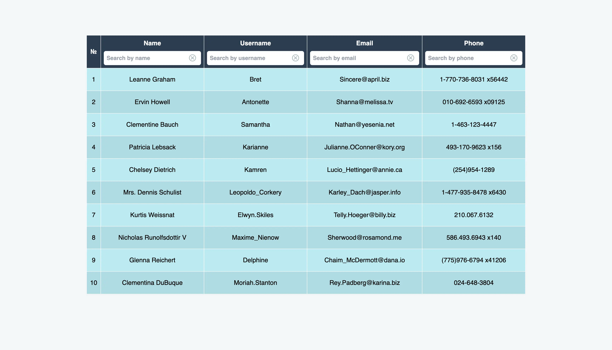

# User-Matrix - application for user data management

## Introduction

Welcome to User-Matrix, a powerful user data management application designed to streamline the
process of organizing and filtering user information. Built with React, Redux Toolkit and
TypeScript, this platform demonstrates the ability to fetch user data from a mock API and apply
advanced search filters for efficient data retrieval.

## Features

- **User Management Table**: Displays user details such as name, username, email, and phone, fetched
  from a mock API.
- **Advanced Filtering**: Enables dynamic filtering of users by name, username, email, and phone,
  with results updating as the user types.

## Screenshots

## Technologies Used:

## Demo

This project is deployed on Vercel. Check it out: [**User-Matrix**](https://user-matrix.vercel.app/)
